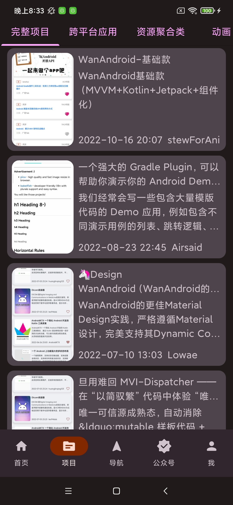
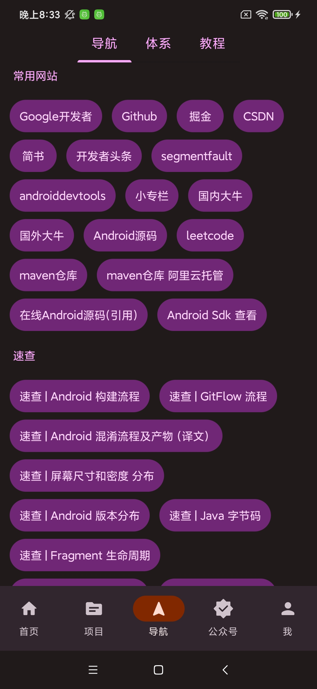
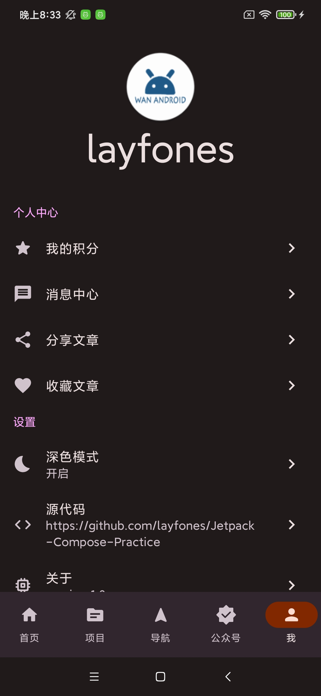
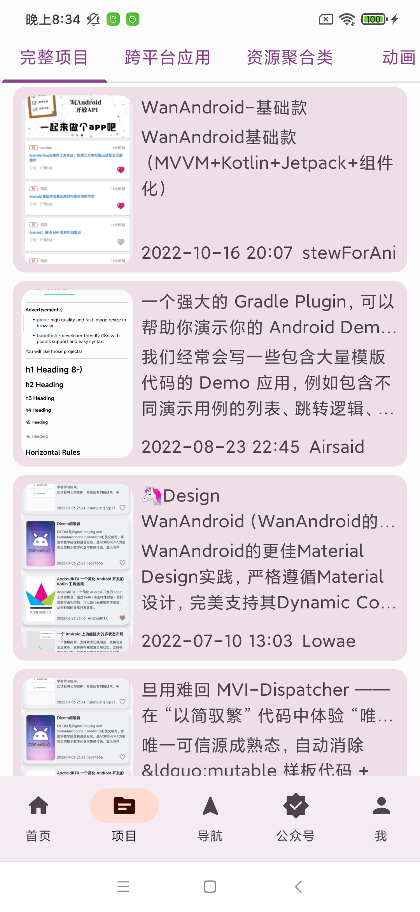
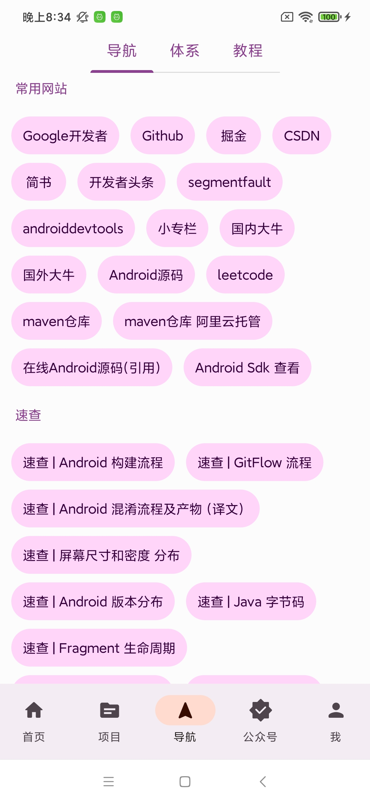
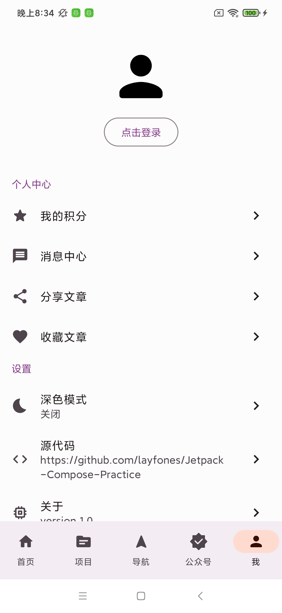

# Jetpack-Compose-Practice
Jetpack Compose Wanandroid

#### 截图展示
----

| 首页                                | 项目                                | 导航                                | 我                                 |
|-----------------------------------|-----------------------------------|-----------------------------------|-----------------------------------|
|  |  |  |  |
|  |  |  |  |
	
----
### TODO:
- 注册
- 用户退出 Dialog
- 页面导航动画
- 搜索

## Thanks:
- 页面最漂亮，代码最优雅，功能最完善的-玩安卓 [Design-WanAndroid](https://github.com/Lowae/Design-WanAndroid)
- 很棒的 Compose 玩安卓 [wanandroid-compose](https://github.com/RicardoJiang/wanandroid-compose)